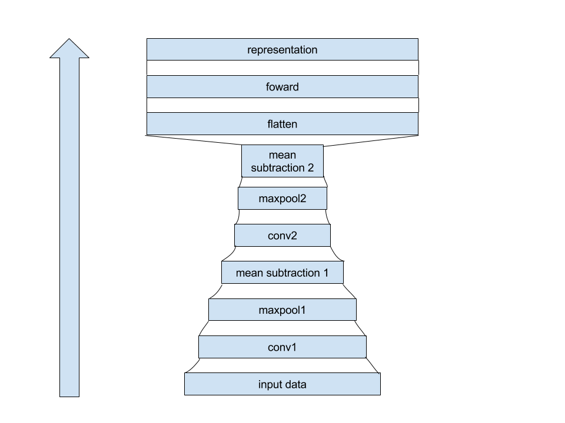

# 10715 Machine Learning course project
Multitask Learning for Semantic Acoustical Embedding
===

## Motivation
Word embeddings have been widely used in various text processing tasks as a way to encode information about its semantic and syntactic properties. Multitask learning can be used when training word embeddings to both generate shared representations for related tasks and learn properties from multiple sources of information. In speech processing, vector acoustic embeddings have recently emerged as an alternative to phonetic unit-based speech representation. While these embeddings are effective in mapping similar sounding words to a similar space, they do not capture other properties of the utterance, such as the semantics of the word being said or information about the speaker of an utterance. We propose a multitask learning framework for semantic acoustic embeddings that encode both phonetic and semantic information of an utterance. In addition to what word is being said and its semantics, we attempt to incorporate other properties found in the speech signal such as gender, age, dialect, and speaker identity, in our speech embeddings.

## Contributions
The contributions of this paper are three-folded.

First, we propose a semantic acoustic embedding that encodes the acoustic and semantic information of speech utterances into vector embeddings. This takes into consideration both the acoustical and semantic information of speech signals, and aids the related downstream tasks with compact representations.

Second, we propose a multitask learning framework that uses the embeddings to do task-specific predictions. The seven tasks that we used in our multitask learning architecture are

1. Word recognition: given an acoustic speech segment, predict the word that was uttered in the segment.

2. Word semantic prediction: given an acoustic speech segment, minimize the distance between the prediction and the pretrained embedding of the word that was uttered.

3. Gender prediction: given an acoustic speech segment, predict the gender of the speaker.

4. Speaker identification: given an acoustic speech segment, predict which speaker is speaking.

5. Age prediction: given an acoustic speech segment, predict the age range of the speaker.

6. Education prediction: given an acoustic speech segment, predict the education level of the speaker.

7. Dialect prediction: given an acoustic speech segment, predict the dialect of the speaker.

Third, we empirically show that with our proposed architecture, we are able to predict the each individual task with high accuracy, but have errors when predicting multitasks because these tasks are not related closely enough to give generative shared speech embeddings. Thus, we need a more robust technique than basic multitask learning in order to construct embeddings that contain properties from all of these tasks.

## Net Structure

## Results
|Task | Age | Gender | Word | Education | Dialect | Speaker|
|:----|----:|-------:|-----:|----------:|--------:|-------:|
|Error | 0.01510 | 0.02093 | 0.1592 | 0.1662 | 0.2093 | 0.2869|

## Conclusions
In this paper, we presented a multitask learning architecture creating word embeddings while capturing both acoustical and semantic information in speech signals, and found that it learned well for each individual task, but the tasks were not related enough to properly learn embeddings for accurate multitask predictions using a standard architecture. We further found that standard gradient descent update approaches suffer from different drawbacks, and compared it with Adagrad, but neither were sufficient to make accurate multitask predictions.

See detailed writeup [Here](writeup/)
